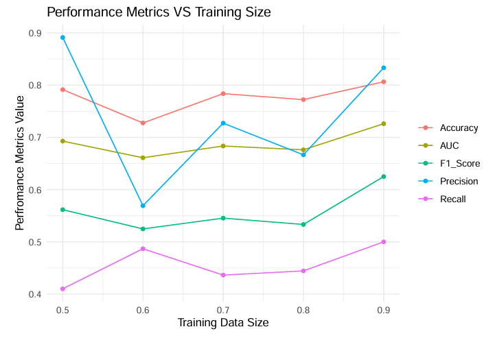
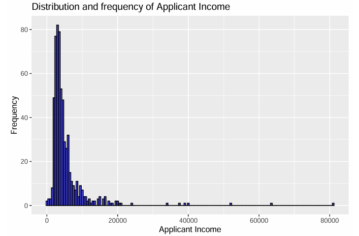
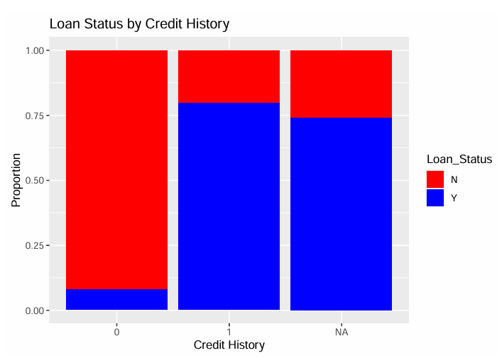
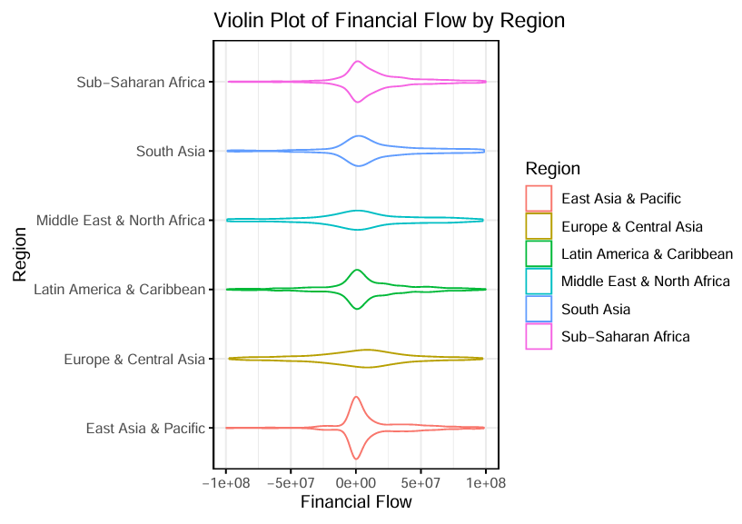
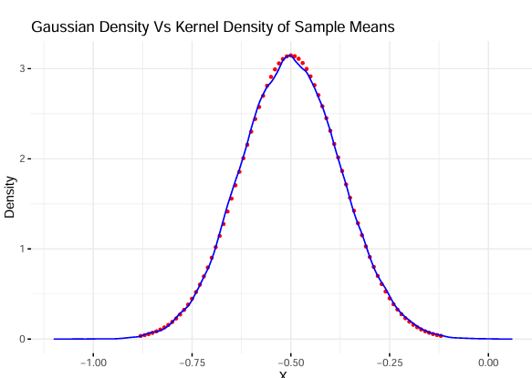

# Statistical Computing & Empirical Methods Using R Programming

**Course:** Statistical Computing & Empirical Methods  
**Timeline:** October 2024 – December 2024  
**Institution:** University of Bristol  
**Author:** Thrisha Rajkumar

This repository contains coursework for the Statistical Computing & Empirical Methods unit, blending foundational statistical techniques, empirical data exploration, and predictive modeling using R.

---

## Project Highlights

### 1. Supervised Learning & Predictive Modelling
- Developed **Decision Tree** and **Random Forest** classifiers for predicting loan approvals.
- Addressed missing data, encoded categorical variables, and engineered features.
- Tuned models via **grid search** with 10-fold **cross-validation**.
- Achieved:
  - **AUC = 0.7949**
  - **F1 Score = 0.70**



---

### 2. Data Wrangling & Exploratory Data Analysis (EDA)
- Cleaned multi-source financial data (13,824 rows, 63 indicators).
- Performed joins, renaming, and grouping by income/region.
- Created insightful plots to explore patterns:

**Income Distribution**  


**Credit History vs Loan Status**  


**Regional Financial Flow (Violin Plot)**  


---

### 3. Statistical Simulation & Computing
- Estimated λ for exponential distribution using **Maximum Likelihood Estimation (MLE)**.
- Bootstrapped 1,000 samples to construct confidence intervals: CI = [0.0191, 0.0207].
- Simulated 100,000 trials of discrete variables.
- Demonstrated **Central Limit Theorem (CLT)** using 50,000 sample means.

**CLT Density Plot**  


**Exponential λ Visualization**  


---

## 📊 Dataset Sources

### 1. Loan Approval Data
- [Kaggle – Finance Loan Approval Prediction](https://www.kaggle.com/datasets/krishnaraj30/finance-loan-approval-prediction-data)
- Includes demographic and financial attributes for binary classification.
- **Note:** Data files (`train.csv`, `test.csv`) are not included due to licensing. Please download them directly from Kaggle.

### 2. Simulated Exponential Data
- Generated internally using `rexp()` in R for bootstrapping & CLT demonstrations.

---

## 📁 Folder Structure

```
Statistical-Computing-R/
│
├── notebooks/                 # R Markdown reports
│   ├── SectionA_Code_Output.Rmd
│   ├── SectionB_Analysis.Rmd
│   └── SectionC_Methodology.Rmd
│
├── reports/                   # Final PDF submissions
│   ├── Section-A.pdf
│   ├── Section-B.pdf
│   └── Section-C.pdf
│
├── images/                    # Visuals used in README
│   ├── applicant_income_histogram.png
│   ├── loan_status_by_credit.png
│   ├── loan_prediction_metrics.png
│   ├── clt_distribution.png
│   ├── exponential_distribution_lambda.png
│   └── eda_violinplot_timeseries.png
│
├── setup.txt                  # Installation and usage instructions
└── README.md                  # This file
```

---

## 🛠 How to Run

### Step 1 – Install Required Packages

```r
install.packages(c("tidyverse", "rpart", "randomForest", "caret", "boot",
                   "ggplot2", "e1071", "reshape2", "knitr"))
```

### Step 2 – Run Models

```r
# Load dataset
train <- read.csv("train.csv")

# Decision Tree
library(rpart)
tree_model <- rpart(Loan_Status ~ ., data = train, method = "class")

# Random Forest
library(randomForest)
rf_model <- randomForest(Loan_Status ~ ., data = train, ntree = 100)
```

### Step 3 – Bootstrap & CLT

```r
library(boot)
lambda_hat <- function(x, i) 1 / mean(x[i])
boot_data <- rexp(1000, rate = 0.02)
boot_lambda <- boot(data = boot_data, statistic = lambda_hat, R = 1000)
boot.ci(boot_lambda, type = "perc")
```

---

## 📑 Documentation

| Section | Description |
|--------|-------------|
| **A**  | Code and outputs for EDA and wrangling |
| **B**  | Descriptive analysis and distribution modeling |
| **C**  | Simulation-based inference, bootstrapping, MLE |

All reports are in the `/reports/` folder.

---

## 🧠 Skills Demonstrated

- R Programming (Tidyverse, ggplot2, caret, rpart, randomForest)
- Data Wrangling & Joining
- Predictive Modelling & Evaluation
- Statistical Estimation (MLE, Bootstrapping)
- Central Limit Theorem Demonstration
- Reproducible Analysis with R Markdown

---

## 📜 License

This repository is for academic and educational purposes under the University of Bristol.  
Reuse is permitted with citation of author and coursework context.
